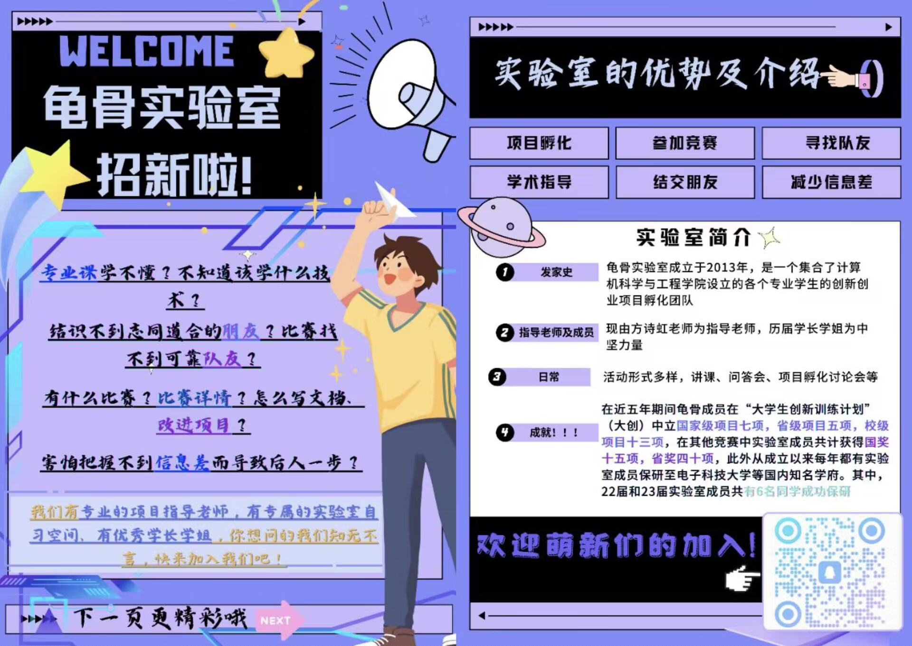

# 欢迎来到龟骨实验室

龟骨实验室成立于 2013 年，是一个集合了计算机科学与工程学院设立的各个专业学生的**创新创业项目孵化团队**，现由方诗虹老师作为龟骨实验室的指导老师。

龟骨实验室成立以来，积极鼓励与组织实验室成员参加校内外各类计算机学科竞赛与创新创业竞赛，让同学们在赛场上展现自己，从而提升同学们的综合实力，培养同学们的创新创业能力与在计算机专业方面的竞争力。

## 关于本站

前端框架 [MkDocs](https://www.mkdocs.org/)，GitHub pages 部署。

GitHub 仓库地址： [smu-guigu.github.io](https://github.com/smu-guigu/smu-guigu.github.io)。

## 建设本站

感谢你对我们的网站感兴趣，我们欢迎各种各样的贡献。

### 介绍

首先，本项目使用 [Git](https://git-scm.com/) 进行版本控制，并托管在 [GitHub](https://github.com/)。因此你最好对 Git 和 GitHub 有一些基本的了解。

其次，整个站点依赖于前端框架 [MkDocs](https://www.mkdocs.org/)，安装及使用可以参考 [这篇教程](https://mkdocs-like-code.readthedocs.io/zh_CN/latest/)。

最后，具体的文章使用 MarkDown 格式书写，语法参考 [官方教程](https://markdown.com.cn/basic-syntax/)。

### 贡献

与一般的 GitHub 项目相似：

1. 将代码克隆到你的远端仓库；
2. 把项目从你的仓库或者主仓库克隆到本地；
3. 在本地修改完成后，使用 Git 推送到你的仓库；
4. 向主仓库提交你的 PR (Pull Request)。

完成这些步骤后，项目的维护者会审查你的改动，并选择（给出修改意见后）接受你的 PR，或者拒绝它。