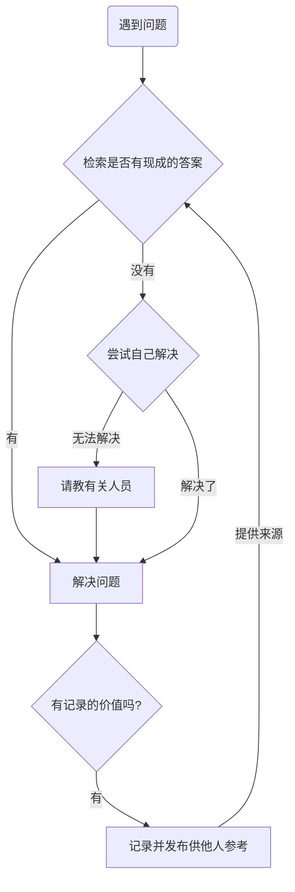

解决问题的能力对于计科学子的重要性不言而喻。然而许多同学习惯了应试教育下标准化的题目，却不知道如何解决自己碰到的、具体的问题。

事实上，**如何解决问题**本身就是一个问题，而本文就尝试为「如何解决问题」这一元问题做出一个可能的回答。在正式开始阅读之前，请先记住一个结论：「请求他人替你解决问题」是无能者最后的手段。

## 流程

许多同学并没有一个固定的解决问题的流程，常常是稍加思索想不出来后，就搬出了无能者最后的手段——然而这是一种懒惰的做法，解决问题是你的责任，其他人没有义务替你解决问题。这里提供一种可能的、自己解决问题的流程：

举例：

John 在使用某款框架的过程中碰到了各种各样的问题，在费力解决后，他把使用框架遇到的问题和对应的解决办法记录了下来，并准备以此为框架所在的仓库贡献一个 PR。这样其他人遇到类似的问题时，就不用再浪费额外的时间和精力：

## 途径

1. ChatGPT
2. 搜索引擎（知识分享、教学平台：Bilibili，YouTube 等）
3. 官方文档
4. 询问有关技术人员。

方便性递减，可靠性递增。前三种途径就足以解决你绝大多数的问题。

记住，「请教有关人员」是你最后的救命稻草，请不要用[愚蠢的提问方式](https://www.bilibili.com/video/BV1om4y1H71S/)放弃最后的机会、浪费别人的时间。

举例：

延续上一个例子的语境：John 费力解决碰到的各种问题，大部分是他自己查资料、读源码解决的，但还有一些则是他实在解决不了，厚着脸皮请教开发者解决的：

其中包含一些提问的技巧：

- 群中有很多人，有的人和问题相关，有的则无关，指明具体的求助者，这有助于他们回答你的问题，同时不用打扰无关人员；
- 清晰地表述你的需求和你碰上的问题，必要时附上你的运行环境、错误日志；
- 说出做过的尝试：一方面，排除了错误答案，缩小了回答范围，更有助于得到正确的答案；另一方面，让对方意识到你不是一个只会抛问题的懒汉，你解决问题的积极态度会让被求助者更愿意回答你的问题。
- 礼仪：保持谦逊（请问一下），别人没有义务回答你的问题，但他却花费时间慷慨地帮助了你，你应该表示感谢（好了，谢谢。点赞表情），这也有助于以后的沟通和求助。

提问的技巧和思路指南：[提问的智慧](https://github.com/ryanhanwu/How-To-Ask-Questions-The-Smart-Way/blob/main/README-zh_CN.md)（**本指南不提供此项目的实际支持服务**）

补充：一种可能的访问 NewBing， Google 和 GitHub 的方法。

## 思路

明确问题和需求——拆分为更小的问题——逐一解决。

### 举例一：

你希望搭建一个静态的博客用于写一些技术文章，同时你也没有愚蠢到直接去问你的学长：「学长学长，如何自己做一个网站？」。

你检索了一番，在 B 站找到了有关的教学视频，你了解到：只需要用 Markdown 写出博客的内容，再通过有关框架把 Markdown 转换成前端代码，最后把前端代码部署在大家都可以访问到的地方就行了——于是，你把一个大的、无从下手的问题转化成了三个明确的小问题。

在逐一解决之后，你成功搭建了自己的个人博客，逢人就炫耀。

### 举例二：

John 希望在终端上渲染一个 3D 的、带光影的、旋转的甜甜圈。他一气呵成写完代码后，发现 Bug 比能正常工作的部分还多。

在无尽的 Debug 的折磨后，他决定先渲染一个静止的、无光效的甜甜圈（哪怕它看上去像一个二维的图案），旋转和光效的事情后面再说。

然而仅仅是这一部分也还是叫他够呛，他决定先渲染一个二维的圆，后面再把它旋转成一个三维的甜甜圈。这次他终于成功了，要是连一个圆都渲染不出来，我们有理由相信：他会去渲染一条线、一个点。

在推导出旋转矩阵后，他不仅完成了二维到三维的跨越，还使得三维的物体能够旋转。

最后，他找到了反映光线反射的过程中光照强度变化的定律——朗伯余弦定律，并用代码实现了它。至此，他把各个部分拼接起来，得到了他梦寐以求的甜甜圈。

