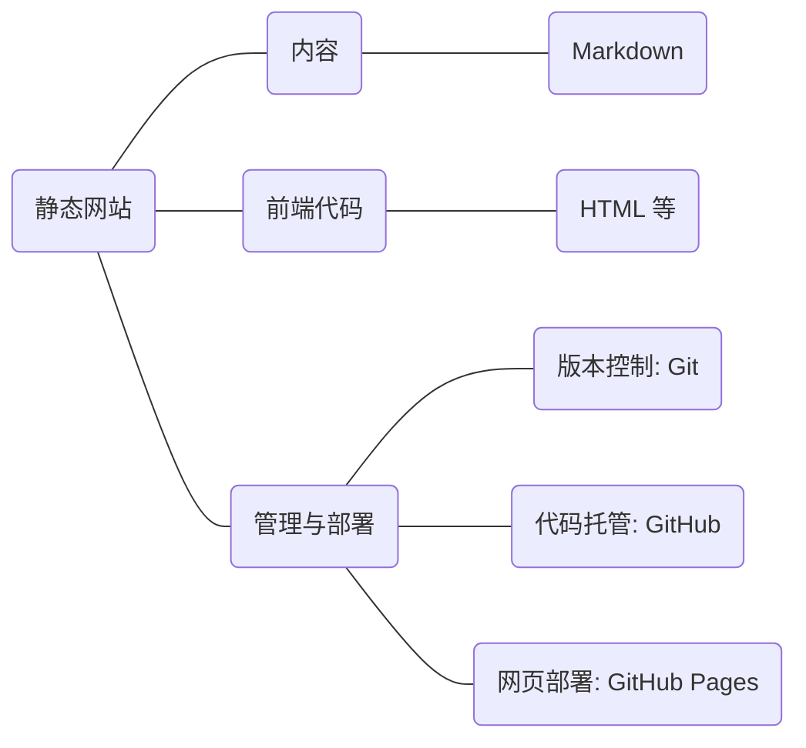

## 目的

- 长期：培养**自学**、**解决问题**、**获取信息和资源**的能力，对计算机、技术体系有更全面的了解；
- 短期：学习常用工具（搜索引擎，ChatGPT，Markdown，Git，GitHub），搭建自己的静态网站。

与其说是课程，不如说是一个实践项目分享。我们只能告诉你有什么可以做，至于做不做、做什么都取决于你自己。

## 模块拆分

说明：此项目以 B 站 UP 主[康文昌](https://space.bilibili.com/34786453)的编程课为基础，补充了 Git 和 GitHub 部分内容。

## 课程规划

### Lesson 1: 如何解决问题：

- 流程
- 途径：ChatGPT—搜索引擎（知识分享、教学平台：Bilibili，YouTube 等）—官方文档—询问有关技术人员。方便性递减，可靠性递增；
- 思路：将大问题拆分成关联的小问题，逐一解决。我们的教学就采取这个思路，大家可以在实践中体会。

补充阅读：[提问的智慧](https://github.com/ryanhanwu/How-To-Ask-Questions-The-Smart-Way/blob/main/README-zh_CN.md)。

如何访问 Google, NewBing 和 GitHub;

### Lesson 2: [编程的本质](https://www.bilibili.com/video/BV1AF411s78P/?spm_id_from=333.999.0.0&vd_source=03836a37b30756921d327ea531c18b88)与标记语言

程序 = 数据 + 函数。

#### 标记语言

标记语言 = 文本 + 标记，「文本」是数据（内容），「标记」则将文本转换（渲染）成特定格式。

  1.   C 语言 printf 函数，运行时的输出；
  2.   HTML，你所见到的网页。手写一个简单的网页并在浏览器中打开；
  3.   Markdown，简单、简洁、优雅的笔记、说明文档格式。
Markdown-HTML 前端框架。

### Lesson 3: 图形界面的 GitHub

GitHub——托管你的代码，GitHub Pages——部署你的网页。

认识一个仓库的各个模块，[good first issue: 到此一游](https://github.com/smu-guigu/smu-guigu.github.io/issues/1)

### Lesson 4: 命令行界面的 Git

Git——对你的代码进行版本控制、分布式地协作。

熟悉命令行环境，Git bash 或 WSL。对比**图形**和**命令行**两种操作方式的优劣。

熟悉 Git：将远端仓库克隆到本地，修改 HTML，通过 Git 上传到 GitHub 的 main 分支。

### Lesson 5: 综合——通过工作流更新网站

在增添、删减、修改你的个人网站的过程中，摸索出一套基于 Git 和 GitHub 的工作流。

当你尝试参与到其他项目中时，你至少掌握了一套基本的工作流程——这会让一个开源新人底气倍增。